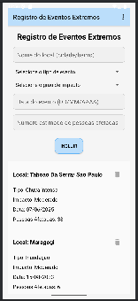
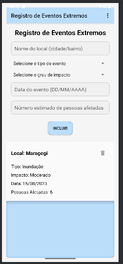
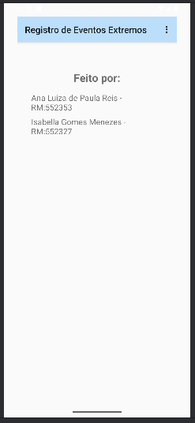

# Global Solution 2025 - Android + Kotlin

**Tema:** Eventos Extremos

## Participantes:

- Ana Luiza de Paula Reis - RM552353
- Isabella Gomes Menezes - RM552327

## Funcionalidades Implementadas:

- Tela principal com campos para cadastrar eventos extremos (Nome do local, Tipo do evento extremo, Grau de impacto, Data do evento, Número estimado de pessoas afetadas).
- Botão "Incluir" para adicionar eventos ao RecyclerView.
- RecyclerView exibindo os detalhes de cada evento extremo em um layout customizado.
- Botão "Excluir" individual para remover itens do RecyclerView.
- Validação de campos obrigatórios e validação para garantir que o número estimado de pessoas afetadas seja maior que zero.
- Tela adicional de identificação acessível via menu na Toolbar.

## Evidências

